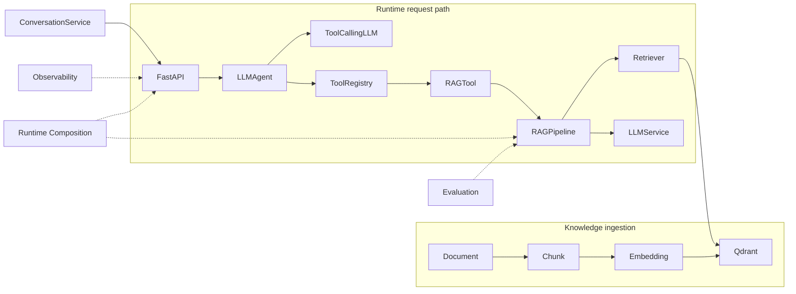

# Enterprise AI Agent

[](https://www.python.org/)
[](https://github.com/catproject7/enterprise-ai-agent/actions/workflows/ci.yml)
[](LICENSE)

Enterprise AI Agent is a modular, production-oriented RAG and Tool Calling
system built with FastAPI, Qdrant, FastEmbed, and an OpenAI-compatible LLM.

It covers document ingestion, chunking, embeddings, vector retrieval, RAG,
citations, tool calling, Agent execution, evaluation, conversation,
observability, and runtime composition with clear dependency boundaries.

## Highlights

- Modular RAG pipeline with dependency injection
- Qdrant-backed vector retrieval
- OpenAI-compatible LLM abstraction
- Tool Calling with `ToolRegistry`
- `Agent -> Tool -> RAG` execution path
- Citation-aware `/rag/query` API
- Evaluation metrics: Recall@K, Precision@K, Exact Match, Citation Coverage
- Runtime composition root for assembling the real Agent stack
- Request ID, timing, and structured observability
- In-memory conversation service
- FastAPI API layer
- `pytest`, Ruff, `uv`, and GitHub Actions

## Tech Stack

| Layer | Technology |
| --- | --- |
| Language | Python 3.13 |
| API | FastAPI |
| LLM | OpenAI-compatible API |
| Embedding | FastEmbed / `BAAI/bge-small-en-v1.5` |
| Vector DB | Qdrant |
| RAG | Custom modular pipeline |
| Agent | Tool Calling Agent |
| Validation | Pydantic |
| Testing | pytest |
| Lint | Ruff |
| Package Management | uv |
| CI | GitHub Actions |

## Architecture



The runtime assembly path is:

```text
Settings
  -> EmbeddingService + VectorStore
  -> Retriever -> RAGPipeline -> RAGTool
  -> ToolRegistry + ToolCallingLLM -> LLMAgent
  -> FastAPI
```

The detailed module and data-flow design is documented in
[`docs/architecture.md`](docs/architecture.md).

## How It Works

### Knowledge ingestion

```text
Document -> Chunk -> Embedding -> Qdrant
```

PDF, Markdown, and TXT loaders produce a unified `Document`. The chunking
layer preserves source metadata and offsets, FastEmbed creates embeddings, and
`QdrantVectorStore` ensures the collection and stores the embedded chunks.

### Retrieval and RAG

```text
Question -> Retriever -> Qdrant -> ContextBuilder
         -> PromptBuilder -> LLMService -> RAGResponse
```

`RAGPipeline` coordinates retrieval, bounded context construction, prompt
construction, generation, and citation creation. Citations identify the
retrieved source chunks included in the prompt. Sentence-level attribution is
not implemented.

### Agent and Tool Calling

```text
HTTP -> Agent[str] -> ToolRegistry -> RAGTool
     -> RAGPipeline -> AgentResult[str] -> HTTP
```

`LLMAgent` supports one LLM-requested Tool Call followed by one final answer.
`RAGTool` adapts the existing `RAGPipeline`, so Agent execution and the direct
RAG API share the same retrieval and generation implementation.

### Supporting systems

- `ConversationService` keeps the Agent stateless and stores conversation
  history in memory for the current process.
- Observability adds request IDs, timing, and structured log events through
  transparent wrappers.
- Evaluation measures retrieval, answer correctness, and citation coverage
  offline.
- Runtime Composition builds configured adapters and injects them into the API.

## Quick Start

### 1. Install

```powershell
uv sync
```

Python 3.13 is required and can be managed by `uv`.

### 2. Configure

```powershell
Copy-Item .env.example .env
```

Set the required LLM API key and point Qdrant at the local service:

```text
ENTERPRISE_AI_AGENT_LLM_API_KEY=your-api-key
ENTERPRISE_AI_AGENT_QDRANT_URL=http://localhost:6333
```

Keep `.env` local. Do not commit real credentials.

### 3. Start Qdrant

```powershell
docker run --rm -d --name enterprise-ai-agent-qdrant `
  -p 6333:6333 -p 6334:6334 qdrant/qdrant
```

### 4. Prepare a demo document

The repository includes `demo/documents/example.md`. You can also place PDF,
Markdown, or TXT files in `demo/documents`.

### 5. Index documents

```powershell
uv run python -m enterprise_ai_agent.runtime.indexing demo/documents
```

This command loads supported files, creates chunks and embeddings, ensures the
configured Qdrant collection, and upserts the vectors.

### 6. Start the Demo Runtime App

```powershell
uv run uvicorn enterprise_ai_agent.runtime.composition:create_runtime_app --factory
```

This app creates the real Agent, RAG, Tool Calling, citation, and conversation
dependencies from `AppSettings`.

### 7. Query RAG with citations

```powershell
Invoke-RestMethod `
  -Method Post `
  -Uri http://127.0.0.1:8000/rag/query `
  -ContentType "application/json" `
  -Body '{"question":"How often must Northstar API keys be rotated?"}'
```

### 8. Query the Agent

```powershell
Invoke-RestMethod `
  -Method Post `
  -Uri http://127.0.0.1:8000/agent/run `
  -ContentType "application/json" `
  -Body '{"input":"How often must Northstar API keys be rotated?"}'
```

The Agent uses Tool Calling and the registered `RAGTool`. The direct
`/rag/query` endpoint is the recommended path when structured citations are
required.

## Demo

The demo path is:

```text
demo/documents/example.md
  -> indexing
  -> Qdrant
  -> POST /rag/query
  -> Answer + Citation
```

Example request:

```json
{
  "question": "How often must Northstar API keys be rotated?"
}
```

Example response shape. This is illustrative output, not a recorded live run:

```json
{
  "answer": "Northstar API keys must be rotated every 90 days.",
  "citations": [
    {
      "result_id": "...",
      "metadata": {
        "source": "demo/documents/example.md",
        "file_name": "example.md",
        "file_type": "markdown",
        "file_size": 361
      },
      "chunk_index": 0,
      "start_offset": 0,
      "end_offset": 361
    }
  ]
}
```

The indexing and API processes must use the same reachable Qdrant instance.
The `:memory:` default is useful for single-process tests, but it cannot share
indexed documents across separate indexing and API processes.

## API

| Method | Endpoint | Purpose |
| --- | --- | --- |
| `GET` | `/health` | Health check |
| `POST` | `/rag/query` | RAG answer with citations |
| `POST` | `/agent/run` | Agent and Tool Calling |
| `POST` | `/conversations` | Create conversation |
| `GET` | `/conversations/{conversation_id}` | Get conversation |
| `POST` | `/conversations/{conversation_id}/messages` | Send message |

`POST /agent/run` accepts `{"input": "..."}` and returns `{"output": "..."}`.
`POST /rag/query` accepts `{"question": "..."}` and returns `answer` plus
citations.

### Runtime App and Health-only App

The Demo Runtime App is:

```powershell
uv run uvicorn enterprise_ai_agent.runtime.composition:create_runtime_app --factory
```

It includes Agent, RAG, Tool Calling, citations, and conversation APIs.

The health-only app is:

```powershell
uv run uvicorn enterprise_ai_agent.api.app:app
```

It does not create real Agent or RAG infrastructure automatically and is
intended for basic API and health scenarios. Agent and RAG endpoints return
`503 Service Unavailable` until the required dependencies are explicitly
injected.

## Evaluation

The evaluation layer is offline and dependency-injected. It can load a JSON
`EvaluationDataset`, run each case through an existing `RAGPipeline`, and
produce an `EvaluationReport`.

```python
from enterprise_ai_agent.evaluation import (
    EvaluationRunner,
    Evaluator,
    load_evaluation_dataset,
)
from enterprise_ai_agent.evaluation.export import serialize_evaluation_report

dataset = load_evaluation_dataset("evaluation.json")
runner = EvaluationRunner(rag_pipeline, Evaluator(), k=5)
report = runner.run(dataset)

print(serialize_evaluation_report(report))
```

Supported metrics:

- Recall@K
- Precision@K
- Normalized exact-match answer correctness
- Citation Coverage

There is no evaluation CLI, dashboard, LLM judge, or external evaluation
framework in the current implementation.

## Testing & CI

Current validation:

- 376 tests passing
- Ruff checks passing
- `git diff --check` passing
- `uv lock --check` passing
- GitHub Actions `quality` job passing

Run the same core checks locally:

```powershell
uv run pytest -q
uv run ruff check .
git diff --check
uv lock --check
```

The GitHub Actions workflow runs Ruff and pytest on pushes to `main` and on
pull requests.

## Project Structure

```text
src/enterprise_ai_agent/
  agent/          # Agent and LLM Tool Calling execution
  api/            # FastAPI routes, models, dependencies, and app factory
  chunking/       # Document chunking and metadata preservation
  conversation/   # In-memory conversation service and store
  core/           # Settings and logging
  embeddings/     # Embedding abstraction and FastEmbed adapter
  evaluation/     # Offline datasets, metrics, runner, and export
  ingestion/      # PDF, Markdown, and TXT loaders
  llm/            # Text generation and Tool Calling adapters
  observability/  # Request context, logging, middleware, instrumentation
  rag/            # Context, prompt, response, pipeline, and execution trace
  retrieval/      # Query embedding and vector search
  runtime/        # Composition root and document indexing entry point
  tools/          # Tool boundary, RAGTool, and ToolRegistry
  vector_store/   # Vector store abstraction and Qdrant adapter

demo/documents/   # Minimal demo knowledge source
docs/             # Architecture documentation
tests/            # Unit, integration, and API tests
```

## Current Limitations

- No authentication or authorization
- Conversation persistence is in-memory
- No streaming response
- Tool Calling currently supports the project's bounded execution path
- No parallel Tool Calling
- No OpenTelemetry integration
- No persistent production database
- No cloud deployment verification
- Local Qdrant demo requires a reachable Qdrant instance

This repository is a personal portfolio engineering implementation, not a
production deployment plan. It does not claim cloud deployment, production
operations, or live smoke-test evidence.

## License

MIT. See [`LICENSE`](LICENSE).
